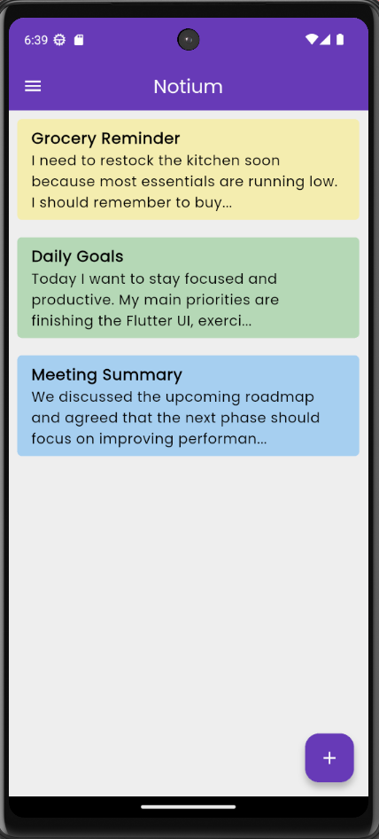
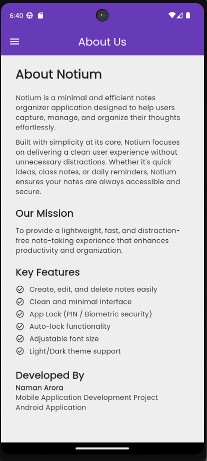
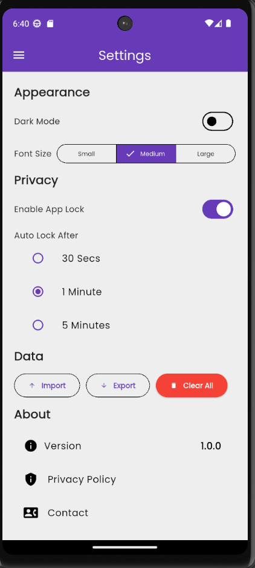
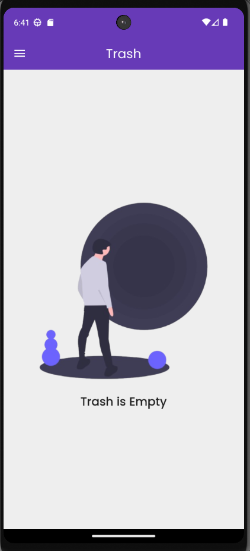

# 📝 Notium

> Modern Notes App

**Notium** is a fast, minimal, and privacy-focused notes application designed for productivity and simplicity. It provides a clean UI, powerful customization options, and secure local storage so you can focus on writing without distractions.

## ✨ Features

- 🗒️ Create, edit, and delete notes
- 🎨 Color-coded notes
- 🌙 Dark / Light mode toggle
- 🔤 Adjustable font size (Small / Medium / Large)
- 🔒 App lock (PIN / Biometrics)
- 💾 Offline-first local storage
- ⚡ Fast and lightweight UI
- 📱 Responsive and smooth experience

## 📸 Screenshots

<div align="center">

<table>
<tr>
<td></td>
<td></td>
</tr>

<tr>
<td></td>
<td></td>
</tr>
</table>

</div>

## ⚙️ Tech Stack

**Frontend**

- Flutter
- Material UI components
- Provider (State Management)

**Storage**

- Hive (Local database)

## 📂 Project Structure

```
lib/
    ├── adapters
    ├── common
    ├── models
    ├── providers
    ├── screens
    ├── services
    ├── theme
    ├── widgets
    └── main.dart
```

## 🚀 Getting Started

### 1️⃣ Clone Repository

```bash
git clone https://github.com/naman22a/notium.git
cd notium
```

### 2️⃣ Install Dependencies

```bash
flutter pub get
```

### 3️⃣ Run App

```bash
flutter run
```

## 🛠 Todos

- [ ] Auto-lock support
- [ ] Export notes (PDF / TXT / JSON)
- [ ] Search inside notes
- [ ] Markdown support
- [ ] Rich text editor
- [ ] Tags & folders

## 🤝 Contributions

Contributions, issues, and suggestions are welcome! Feel free to fork the repository and submit pull requests.

## 📫 Stay in touch

- Author - [Naman Arora](https://namanarora.xyz)
- Twitter - [@naman_22a](https://x.com/naman_22a)

## 🗒️ License

Notium is [GPL V3](./LICENSE)
